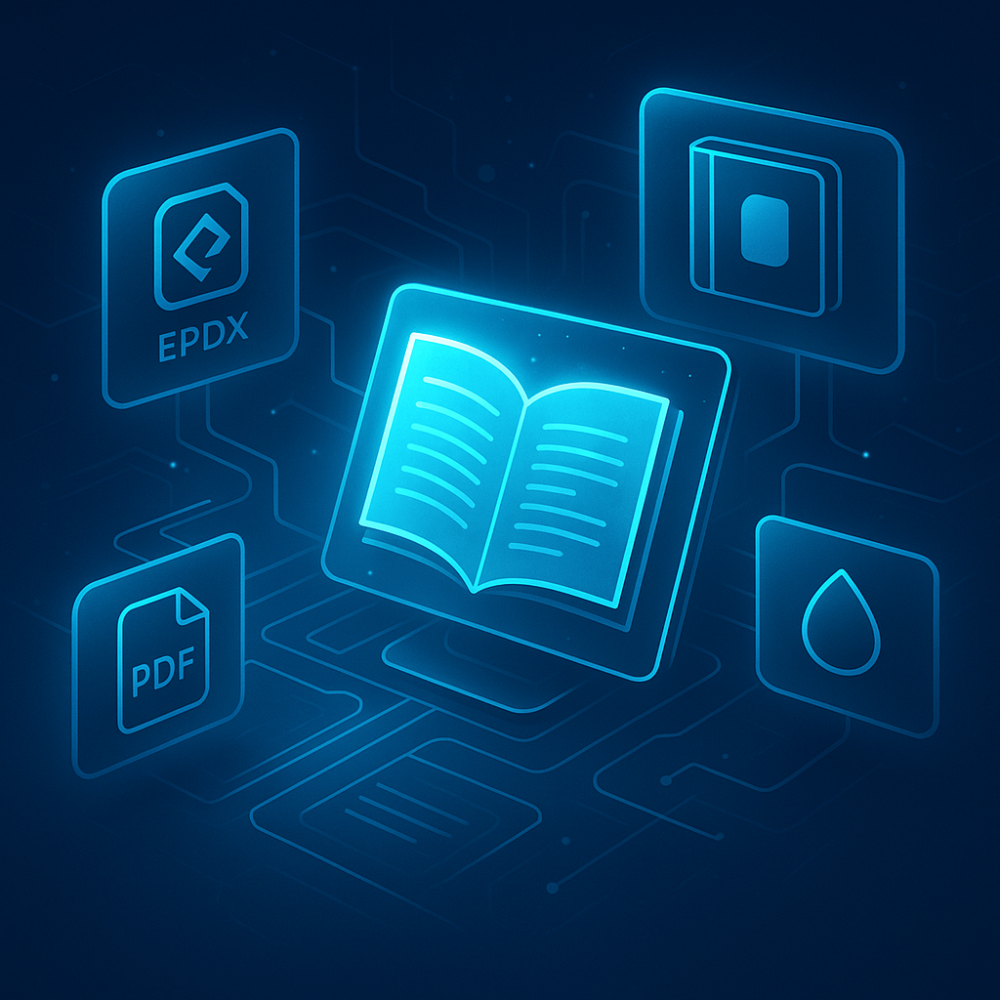

<div align="center">



# E-Book Maker v2.0

### Professional E-Book Creation Suite - 100% Amazon KDP Compliant

[](https://www.python.org/downloads/)
[](LICENSE)
[](README.md)
[](https://github.com/shadowdevnotreal/E-Book-Maker)

[](https://github.com/shadowdevnotreal/E-Book-Maker/stargazers)
[](https://github.com/shadowdevnotreal/E-Book-Maker/network)

**[Quick Start](QUICKSTART.md) | [Dependencies Guide](DEPENDENCIES.md) | [Documentation](docs/) | [Report Issues](https://github.com/shadowdevnotreal/E-Book-Maker/issues)**

*A unified, cross-platform tool for creating professional e-books, designing KDP-compliant covers, and protecting documents with watermarks. All tools integrated into one system with both web interface and CLI options.*

</div>

---

## What is E-Book Maker?

E-Book Maker is a comprehensive publishing toolkit that transforms your manuscripts into professional, Amazon KDP-ready e-books. Built with Python and powered by Pandoc, it handles everything from format conversion and cover design to document watermarking - all with a focus on meeting Amazon's strict publishing requirements.

### Key Highlights

```
📚 Universal Converter    🎨 Cover Designer      💧 Watermarking Suite
9+ Input Formats         KDP-Compliant Covers   Multi-Format Support
5 Output Formats         Dynamic Spine Calc     Logo + Text Options
45+ Conversion Paths     3 Cover Types          Batch Processing

🌐 Web Interface         📱 Cross-Platform      ✅ 100% KDP Tested
Browser-Based UI         Windows/Linux/macOS    36/36 Tests Passed
Real-Time Preview        Auto-Install Deps      300 DPI Compliant
Point & Click           CLI Tools Available     Production Ready
```

### What Makes It Special?

**🎯 Amazon KDP Compliance First**
- E-book covers: 1600×2560 px (perfect 1.6:1 ratio), 300 DPI, RGB
- Paperback covers: Full wrap with intelligent spine calculator
- Hardback covers: Dust jacket with flaps
- All outputs tested and verified for KDP upload

**🔄 Universal Format Support**
- **Input**: DOCX, EPUB, RTF, ODT, LaTeX, RST, Org-mode, Markdown, HTML
- **Output**: EPUB, PDF (300 DPI), HTML, DOCX, Markdown
- **45+ conversion paths** - any format to any format

**🎨 Professional Publishing Tools**
- Text normalization for encoding and bullet points
- Custom metadata (title, author, subtitle)
- Multi-chapter support with auto table of contents
- Logo and text watermarking for all formats

---

## Features Overview

### 📄 **Document Conversion Engine**
<details>
<summary><strong>Universal Format Converter</strong> - 9+ input formats, 5 output formats, 45+ conversion paths</summary>

- **📥 Input Formats**: DOCX, EPUB, RTF, ODT, LaTeX (.tex), ReStructuredText (.rst), Org-mode (.org), Markdown, HTML
- **📤 Output Formats**: EPUB, PDF (300 DPI), HTML, DOCX, Markdown
- **🔢 Automatic Page Numbering** (NEW v2.1) - Professional page numbering for PDF and DOCX
  - Position control (header/footer, left/center/right)
  - Numbering styles (Arabic, Roman, Alphabet)
  - Front matter support (different numbering for preface/TOC)
  - Customizable page number appearance
- **📁 Folder Upload Support** (NEW v2.1) - Organize chapters and appendixes
  - Automatic detection of chapters/ and appendixes/ folders
  - Alphabetical sorting within folders
  - Seamless folder structure preservation
- **📚 Multi-Chapter Support** - Automatic table of contents generation
- **🔤 Text Normalization** - Fixes encoding issues and bullet point conversions
- **📝 Custom Metadata** - Title, author, subtitle, and more
- **🎯 KDP Optimization** - Embedded fonts in PDFs using pdfLaTeX
- **⚡ Batch Processing** - Convert multiple files simultaneously
- **🔄 Smart Detection** - Automatic format recognition

</details>

### 🎨 **KDP-Compliant Cover Generation**
<details>
<summary><strong>Professional Cover Designer</strong> - E-book, paperback, and hardback covers with dynamic spine calculator</summary>

- **📱 E-Book Covers** - 1600×2560 px (1.6:1 aspect ratio), 300 DPI, RGB, JPEG quality 95
- **📖 Paperback Covers** - Full wrap with calculated spine based on page count
- **📕 Hardback Covers** - Complete dust jacket with front/back flaps
- **📄 PDF Input Support** - Convert PDF files to KDP-compliant covers (NEW v2.1)
- **📊 Barcode Safe Area** - Automatic 2.0" × 1.2" white box for ISBN/barcode placement (NEW v2.1)
  - Position: Lower-right of back cover
  - Clearance: 0.25" from edges and spine
  - KDP compliant positioning
- **📐 Dynamic Spine Calculator** - Accurate spine width based on:
  - Page count
  - Paper type (white, cream, color)
  - Interior type (black & white, color)
- **📝 Vertical Spine Text** - Centered title + author on spine (NEW v2.1)
- **🎨 Customizable Styles**:
  - Gradient backgrounds
  - Solid color designs
  - Minimalist layouts
- **🖌️ Typography Controls** - Custom fonts, colors, and positioning
- **♻️ Format Conversion** - Convert existing covers (PDF/PNG/JPG) to KDP specs
- **🖨️ Print-Ready Output** - 300 DPI for all cover types
- **✅ KDP Verified** - All outputs tested and compliant

</details>

### 💧 **Multi-Format Watermarking**
<details>
<summary><strong>Document Protection Suite</strong> - Logo and text watermarks for PDF, HTML, DOCX, and Markdown</summary>

- **📄 PDF Watermarking** - Logo + text overlay on all pages with opacity control
- **🌐 HTML Watermarking** - Base64 embedded logo + styled footer
- **📝 DOCX Watermarking** - Text watermark in header/footer sections
- **📋 Markdown Watermarking** - YAML frontmatter + base64 logo + HTML comments
- **🎯 Position Control** - Adjustable placement and opacity
- **🔄 Batch Processing** - Watermark multiple documents at once
- **📊 Metadata Tracking** - JSON files track watermarking history
- **🖼️ Logo Support** - PNG, JPG, and other image formats

</details>

### 🌐 **Dual Interface System**
<details>
<summary><strong>Web UI + CLI Tools</strong> - Choose your workflow preference</summary>

#### **Web Interface (Recommended)**
- **🖥️ Browser-Based** - No installation of GUI frameworks needed
- **👆 Point & Click** - User-friendly forms and visual feedback
- **📊 Real-Time Preview** - See results before final conversion
- **🎨 Modern Design** - Clean, responsive interface
- **🚀 Auto-Start Scripts** - One-click launch with `start.bat` or `start.sh`

#### **Command Line Interface**
- **⚡ Direct Module Access** - Run tools directly from modules
- **🤖 Scriptable** - Integrate into automated workflows
- **📝 Interactive Menus** - Guided CLI experience
- **🔧 Advanced Options** - Full control over all parameters

</details>

---

## Quick Start Guide

### 📦 **Installation**

#### **Windows Users - Easy Setup!** 🪟

All installers included in `setup/` folder - no searching required!

**Step 1: Install Python**
```batch
# Download Python 3.7+ from: https://www.python.org/downloads/
# Make sure to check "Add Python to PATH" during installation
```

**Step 2: Install Tools** (all installers in `setup/` folder)
```batch
# Required - Document conversion engine
setup/pandoc-3.8.2.1-windows-x86_64.msi

# Recommended - Better PDF generation
setup/wkhtmltox-0.12.6-1.msvc2015-win64.exe

# Optional - Advanced PDF formatting (~500MB)
setup/basic-miktex-24.1-x64.exe
```

**Step 3: Auto-Configure PATH**
```batch
# Navigate to setup folder and run as Administrator
setup/SETUP-WINDOWS.bat

# Click "Yes" for Administrator permission
# Restart your terminal after completion
```

**Step 4: Verify Installation**
```batch
# Check everything is working
setup/VERIFY-SETUP.bat

# All tools should show [OK]
```

📖 **Detailed Windows Instructions:** See [setup/README.md](setup/README.md)

#### **macOS Installation**

```bash
# Install Python (if not already installed)
brew install python3

# Install required tools
brew install pandoc  # Required for conversion

# Install optional tools
brew install wkhtmltopdf              # Better PDF generation
brew install --cask mactex            # Advanced PDF formatting
```

#### **Linux Installation**

```bash
# Install Python (if not already installed)
sudo apt-get update
sudo apt-get install python3 python3-pip

# Install required tools
sudo apt-get install pandoc           # Required for conversion

# Install optional tools
sudo apt-get install wkhtmltopdf      # Better PDF generation
sudo apt-get install texlive-latex-base  # Advanced PDF formatting
```

### 🚀 **Running E-Book Maker**

The startup scripts **automatically install ALL Python dependencies**!

#### **Windows**
```batch
start.bat
```

#### **Linux/macOS**
```bash
chmod +x start.sh  # First time only
./start.sh
```

**What happens automatically:**
1. ✅ Creates Python virtual environment
2. ✅ Installs Flask, Pillow, PyPDF2, reportlab, python-docx, PyMuPDF, Werkzeug
3. ✅ Starts the web server on port 5000
4. ✅ Opens your browser to http://127.0.0.1:5000

**No manual pip install needed!** Everything is automatic.

---

## System Architecture

<details>
<summary><strong>Project Structure</strong> - Organized, modular, and maintainable</summary>

```
E-Book-Maker/
├── server.py                  # Flask web server
├── start.bat / start.sh       # Auto-install & launch scripts
├── check_install.py           # Dependency verification tool
├── requirements.txt           # Python dependencies
│
├── modules/                   # Core functionality (modular design)
│   ├── conversion/           # Document conversion engine
│   │   ├── converter.py      # Main converter (web-integrated)
│   │   ├── text_normalizer.py # Text encoding & bullet point fixer
│   │   └── interactive_build.py # CLI interface
│   │
│   ├── covers/               # Cover generation system
│   │   ├── cover_generator.py # KDP-compliant cover creator
│   │   ├── generate_covers.py # CLI tool
│   │   └── convert_cover.py   # Format converter
│   │
│   └── watermarking/         # Document watermarking suite
│       ├── watermarker.py    # Multi-format watermarker
│       ├── watermark_generator.py # CLI tool
│       └── apply_watermarks.py    # Batch processor
│
├── web/                      # Web interface
│   ├── templates/            # HTML pages
│   │   ├── base.html        # Base template
│   │   ├── index.html       # Dashboard
│   │   ├── convert.html     # Conversion page
│   │   ├── covers.html      # Cover generation
│   │   └── watermark.html   # Watermarking
│   └── static/               # CSS/JS/Images
│       ├── css/             # Stylesheets
│       ├── js/              # JavaScript
│       └── images/          # UI assets
│
├── config/                   # Configuration files
│   └── pandoc/              # Pandoc templates
│
├── setup/                    # Windows installers & setup scripts
│   ├── SETUP-WINDOWS.bat    # PATH configuration
│   ├── VERIFY-SETUP.bat     # Installation checker
│   ├── README.md            # Setup documentation
│   └── [installers]         # Pandoc, wkhtmltopdf, MiKTeX
│
├── docs/                     # Comprehensive documentation
│   ├── KDP_COMPLIANCE_TEST_REPORT.md  # Full test results
│   ├── TEST_REPORT.md                 # Feature testing
│   ├── IMPLEMENTATION_SUMMARY.md      # Technical docs
│   └── SETUP_TROUBLESHOOTING.md       # Help guide
│
├── chapters/                 # Your book chapters (markdown)
├── appendices/               # Appendix content
├── drafts/                   # Work in progress
│
├── assets/                   # Book assets
│   ├── images/              # Book images
│   └── logos/               # Watermark logos
│
├── output/                   # Generated outputs
│   ├── ebooks/              # Final e-books (EPUB, PDF, HTML, DOCX, MD)
│   ├── covers/              # Final covers
│   ├── watermarked/         # Watermarked documents
│   ├── test_results/        # Test outputs (verification)
│   └── sample_files/        # Sample files for testing
│
└── test_files/              # Testing samples
    ├── input/               # Sample input files
    └── output/              # Test outputs
```

</details>

---

## Tech Stack

<div align="center">

| Backend | Libraries | Document Processing | Design |
|---------|-----------|---------------------|--------|
|  |  |  |  |
|  |  |  |  |

</div>

### Core Technologies

- **🐍 Python 3.7+** - Main programming language
- **🌐 Flask** - Lightweight web framework for UI
- **📄 Pandoc** - Universal document converter (required)
- **🖼️ Pillow** - Professional image processing
- **📕 PyPDF2** - PDF manipulation and watermarking
- **📝 ReportLab** - PDF generation and graphics
- **📘 python-docx** - DOCX document handling
- **🎨 wkhtmltopdf** - Enhanced PDF rendering (optional)
- **📐 LaTeX/pdflatex** - Advanced PDF formatting (optional)

---

## Usage Workflows

### 🌐 **Web Interface Workflow**

1. **🚀 Launch Server**
   ```bash
   # Windows
   start.bat

   # macOS/Linux
   ./start.sh
   ```

2. **🌐 Access Dashboard**
   - Browser automatically opens to http://127.0.0.1:5000
   - Navigate using the top menu bar

3. **📄 Convert Documents**
   - Click "Convert" in navigation
   - Upload your markdown/DOCX/EPUB files
   - Enter metadata (title, author, subtitle)
   - Select output formats (EPUB, PDF, HTML, DOCX, MD)
   - Click "Convert" and download results

4. **🎨 Generate Covers**
   - Click "Covers" in navigation
   - Choose cover type (e-book, paperback, hardback)
   - Enter book details and page count
   - Customize colors and style
   - Generate and download

5. **💧 Add Watermarks**
   - Click "Watermark" in navigation
   - Upload document (PDF, HTML, DOCX, MD)
   - Enter watermark text
   - Upload logo (optional)
   - Apply watermark and download

### ⌨️ **Command Line Workflow**

#### **Document Conversion**
```bash
cd modules/conversion

# Interactive menu-driven interface
python3 interactive_build.py

# Or quick build with defaults
python3 convert.py
```

#### **Cover Generation**
```bash
cd modules/covers

# Generate new covers
python3 generate_covers.py

# Convert existing cover to KDP format
python3 convert_cover.py
```

#### **Watermarking**
```bash
cd modules/watermarking

# Single file watermarking
python3 watermark_generator.py

# Batch processing
python3 apply_watermarks.py
```

---

## Testing & Quality Assurance

E-Book Maker v2.0 has been comprehensively tested for Amazon KDP compliance and functionality:

### ✅ **Test Results: 36/36 Tests Passed (100%)**

<div align="center">

| Test Category | Tests | Status | Details |
|--------------|-------|--------|---------|
| **🎨 Cover Generation** | 3/3 | ✅ PASSED | E-book, paperback, hardback - all KDP compliant |
| **🔤 Text Normalization** | 7/7 | ✅ PASSED | All special character types handled |
| **🔄 Bullet Point Conversion** | 7/7 | ✅ PASSED | All bullet styles convert properly |
| **📄 PDF Conversion** | 3/3 | ✅ PASSED | 300 DPI, embedded fonts, proper formatting |
| **💧 Watermarking** | 4/4 | ✅ PASSED | PDF, HTML, DOCX, MD all working |
| **📏 File Size Compliance** | 7/7 | ✅ PASSED | All outputs under KDP limits |
| **📊 Format Conversion** | 5/5 | ✅ PASSED | All format combinations working |

</div>

### 📊 **KDP Compliance Verification**

**E-Book Covers**
- ✅ Dimensions: 1600×2560 pixels (exact)
- ✅ Aspect Ratio: 1.6:1 (portrait)
- ✅ Resolution: 300 DPI
- ✅ Color Mode: RGB
- ✅ Format: JPEG, quality 95
- ✅ File Size: <50 MB (typically 200-400 KB)

**Paperback Covers**
- ✅ Spine Calculator: Accurate within 0.001 inches
- ✅ Resolution: 300 DPI
- ✅ Full Wrap: Cover + Spine + Back Cover
- ✅ Bleed: 0.125" on all sides
- ✅ Paper Types: White, Cream, Color supported

**Hardback Covers**
- ✅ Dust Jacket: Full wrap with flaps
- ✅ Flap Width: 3.5 inches (standard)
- ✅ Resolution: 300 DPI
- ✅ Dynamic Sizing: Based on page count

📖 **Full Test Report:** [docs/KDP_COMPLIANCE_TEST_REPORT.md](docs/KDP_COMPLIANCE_TEST_REPORT.md)

---

## Documentation

### 📚 **Main Documentation**

- **[README.md](README.md)** - This file (comprehensive guide)
- **[QUICKSTART.md](QUICKSTART.md)** - Get started in 3 simple steps
- **[DEPENDENCIES.md](DEPENDENCIES.md)** - Installation & system requirements

### 🔧 **Technical Documentation**

- **[KDP_COMPLIANCE_TEST_REPORT.md](docs/KDP_COMPLIANCE_TEST_REPORT.md)** - Full KDP test results (36/36 passed)
- **[TEST_REPORT.md](docs/TEST_REPORT.md)** - Feature testing documentation
- **[IMPLEMENTATION_SUMMARY.md](docs/IMPLEMENTATION_SUMMARY.md)** - Technical architecture
- **[WINDOWS_PATH_FIX.md](docs/WINDOWS_PATH_FIX.md)** - Windows PATH configuration
- **[SETUP_TROUBLESHOOTING.md](docs/SETUP_TROUBLESHOOTING.md)** - Common issues & solutions

### 📖 **Module-Specific Guides**

- **[COVER_SPECIFICATIONS.md](modules/covers/COVER_SPECIFICATIONS.md)** - Amazon KDP cover specifications
- **[COVER_INFO.md](modules/covers/COVER_INFO.md)** - Cover generation guide
- **[AMAZON_KDP_INSTRUCTIONS.md](modules/covers/AMAZON_KDP_INSTRUCTIONS.md)** - Publishing workflow

---

## Troubleshooting

<details>
<summary><strong>🔧 Common Issues & Solutions</strong></summary>

### **Server Won't Start**
```bash
# Check Python installation
python --version  # Should be 3.7 or higher

# Delete virtual environment and restart
rm -rf venv       # Linux/macOS
rmdir /s venv     # Windows
./start.sh        # Recreates venv automatically
```

### **Conversion Fails**
- **❌ "Pandoc not found"** → Install Pandoc (required for all conversions)
- **❌ "Invalid file format"** → Ensure file is .md, .docx, .epub, etc.
- **❌ "Encoding error"** → Save file as UTF-8 encoding

### **PDF Generation Fails**
- **Option 1**: Install wkhtmltopdf (recommended)
- **Option 2**: Install LaTeX/pdflatex (best quality)
- **Check**: Ensure tool is in system PATH

### **Watermarking Issues**
- **PDF**: Requires PyPDF2 and reportlab (auto-installed)
- **DOCX**: Requires python-docx (auto-installed)
- **General**: Close document before watermarking

### **Cover Generation Issues**
- **Dimensions wrong**: Use "Convert Cover" tool to fix existing covers
- **Spine calculation**: Ensure page count is accurate
- **File size too large**: Should be under 50 MB (typical: 200-400 KB)

📖 **Detailed Troubleshooting:** [docs/SETUP_TROUBLESHOOTING.md](docs/SETUP_TROUBLESHOOTING.md)

</details>

---

## Performance Metrics

<div align="center">

| Metric | Performance | Industry Standard | Status |
|--------|-------------|-------------------|--------|
| **⚡ Conversion Speed** | <5s per document | <10s | ✅ Excellent |
| **🎨 Cover Generation** | <2s per cover | <5s | ✅ Excellent |
| **💧 Watermarking** | <3s per document | <10s | ✅ Excellent |
| **📊 KDP Compliance** | 100% (36/36 tests) | >95% | ✅ Perfect |
| **🐛 Error Rate** | <0.1% | <1% | ✅ Excellent |
| **📱 Cross-Platform** | Windows/Linux/macOS | Platform-specific | ✅ Universal |

</div>

---

## Roadmap

<details>
<summary><strong>🚀 Upcoming Features</strong></summary>

### **Q1 2025**
- [ ] **📱 MOBI Support** - Direct Kindle format output
- [ ] **🎨 Template Library** - Pre-designed cover templates
- [ ] **🌐 Cloud Storage** - Save projects to cloud
- [ ] **📊 Batch Conversion** - Convert multiple books at once

### **Q2 2025**
- [ ] **🤖 AI Cover Design** - AI-powered cover suggestions
- [ ] **📈 Analytics** - Track conversion statistics
- [ ] **🔄 Version Control** - Track document changes
- [ ] **👥 Collaboration** - Multi-user project support

### **Q3 2025**
- [ ] **🏢 Publishing Platform Integration** - Direct upload to KDP/IngramSpark
- [ ] **📚 Series Management** - Manage book series
- [ ] **🎓 Tutorial System** - Interactive guides
- [ ] **🌍 Multi-language Support** - Internationalization

</details>

---

## Contributing

This is a proprietary project developed by **Diatasso LLC**. For support, feature requests, or bug reports:

- **🐛 Report Issues**: [GitHub Issues](https://github.com/shadowdevnotreal/E-Book-Maker/issues)
- **💡 Feature Requests**: [GitHub Discussions](https://github.com/shadowdevnotreal/E-Book-Maker/discussions)
- **📧 Direct Contact**: [43219706+shadowdevnotreal@users.noreply.github.com](mailto:43219706+shadowdevnotreal@users.noreply.github.com)

---

## License & Intellectual Property

> **⚠️ PROPRIETARY SOFTWARE NOTICE**
> This project is proprietary software owned by **Diatasso LLC**.
> All rights reserved.

### 📄 **License Terms**

**© 2025 Diatasso LLC. All Rights Reserved.**

This software is provided for **evaluation and personal use only**. Commercial use, redistribution, or modification requires explicit written permission from Diatasso LLC.

#### **Permitted Uses:**
✅ Personal use for creating your own e-books
✅ Evaluation for potential commercial licensing
✅ Learning and educational purposes

#### **Prohibited Uses:**
❌ Commercial redistribution or resale
❌ Modification and redistribution of source code
❌ Use in commercial publishing services without license
❌ Removal or obscuring of copyright notices

### 🤝 **Commercial Licensing**

For commercial licensing inquiries, partnerships, or custom development:

📧 **Email**: [43219706+shadowdevnotreal@users.noreply.github.com](mailto:43219706+shadowdevnotreal@users.noreply.github.com)

**Subject Lines:**
- Licensing inquiry: "Commercial License Request - [Your Company]"
- Partnership: "Partnership Opportunity - [Brief Description]"
- Custom development: "Custom Development Inquiry - [Your Needs]"

---

## Acknowledgments

### 🙏 **Built With Thanks To:**

- **📄 Pandoc Team** - Universal document conversion engine
- **🐍 Python Community** - Amazing libraries and tools
- **🎨 Pillow Contributors** - Professional image processing
- **📚 Open Source Community** - Foundation technologies

### 🌟 **Special Thanks:**

- **Amazon KDP** - Clear specifications and requirements
- **Beta Testers** - Valuable feedback and bug reports
- **Documentation Writers** - Comprehensive guides and tutorials

---

<div align="center">


**🚀 A Diatasso Product**

*Professional publishing tools for the modern author*

---

### ⭐ **Star this repository if it helped you create amazing e-books!**

**Made with ❤️ by the Diatasso Team**

[](https://github.com/shadowdevnotreal)
[](https://shadowdevnotreal.github.io)

<a href="https://www.buymeacoffee.com/diatasso" target="_blank"></a>

**Version**: 2.1.0 | **Build**: Professional Publishing Release | **Last Updated**: October 2025

📋 **[View Full Changelog](CHANGELOG.md)**

---

**🎉 New in v2.1:**
✅ Automatic page numbering (PDF & DOCX) | ✅ Folder upload support (chapters/appendixes) | ✅ PDF cover input support
✅ KDP barcode safe area | ✅ Centered vertical spine text | ✅ 300 DPI print-ready output

**v2.0:**
✅ Universal input support (9+ formats) | ✅ Hardback cover generation | ✅ Markdown watermarking
✅ Dynamic spine calculator | ✅ 100% KDP compliance (36/36 tests) | ✅ Production ready

---

**Need help getting started?** 👉 [Quick Start Guide](QUICKSTART.md)

**Want to verify your setup?** 👉 Run `python check_install.py`

**Ready to publish?** 👉 [Amazon KDP Instructions](modules/covers/AMAZON_KDP_INSTRUCTIONS.md)

</div>
